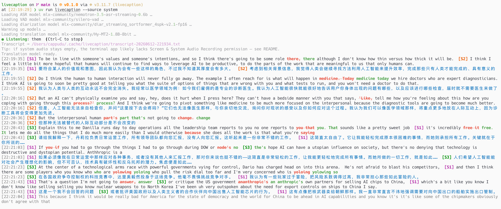

[简体中文](README.md) | **English**

# livecaption

A command-line tool for real-time English transcription plus Chinese translation, running fully on-device on macOS. No UI; output goes to the terminal or a text file.



- **ASR**: mlx-audio running NVIDIA `nemotron-3.5-asr-streaming-0.6b` (a cache-aware, truly streaming transducer) on the Apple Silicon GPU / MLX; endpointing via Silero VAD (mlx port).
- **Speaker diarization** (on by default, disable with `--no-diarize`): NVIDIA Sortformer v2.1 streaming model, up to 4 speakers; sentences are split per speaker, tagged S1/S2/…, and translated individually, with stable speaker numbering throughout the session.
- **Translation**: mlx-lm running `Hy-MT2-1.8B-8bit` (Tencent Hunyuan MT, third generation) on the Apple Silicon GPU.
- **Audio sources**: microphone, meeting/system audio (Zoom/Teams/browser speaker output), or both as two separate tracks.

Both ASR and translation run on the Apple GPU (unified memory); the VAD keeps silent segments out of the encoder so the GPU is only busy while someone is speaking; translation only processes ASR's finalized sentences and never back-pressures the audio. Finalized sentences go through two-pass correction: live captions use low-latency streaming decoding, and when a sentence ends the whole sentence is re-decoded once with maximum look-ahead, with the final text and translation both using the more accurate re-decoded result.

## Prerequisites

- macOS 14.2+ (system audio capture relies on a Core Audio process tap; on Tahoe, 26.1 or newer is recommended)
- Apple Silicon
- [uv](https://docs.astral.sh/uv/)
- Required only for the `system` / `both` audio sources: Swift 5.9+ (to build audiotee)

## Installation

```bash
uv sync
# Only when you need to capture meeting/system audio, build audiotee:
bash scripts/build_audiotee.sh
```

On first run, the ASR model (~1.2GB), Silero VAD (tiny), the Sortformer diarization model (~225MB, on by default; disable with `--no-diarize`), and the translation model (~2GB) are downloaded automatically from Hugging Face.

## Usage

```bash
# Real-time transcription + translation from the microphone, output to the terminal
uv run livecaption --source mic

# Transcribe meeting output (system audio) and write to a file
uv run livecaption --source system --out meeting.md

# Two separate tracks: transcribe your own microphone and the other side simultaneously
uv run livecaption --source both --out meeting.md

# Transcribe an audio file (meeting recording review / end-to-end test; wav/mp3/m4a, auto-resampled, exits when done)
uv run livecaption --source file --file recording.m4a --out recording.md

# Translation includes the previous 3 sentences of context by default (improves pronoun reference / terminology consistency); to disable or adjust:
uv run livecaption --source system --context 0

# Transcribe only, no translation
uv run livecaption --source mic --no-translate

# Translate to Japanese, switch to a larger translation model
uv run livecaption --target-lang ja-jp --mt-model mlx-community/Hy-MT2-7B-4bit

# Non-English meeting: specify the spoken language (40 locales; an invalid value lists all options)
uv run livecaption --asr-lang de-de --target-lang zh-cn

# Capture a single app only (first get Zoom's PID via `ps` / Activity Monitor)
uv run livecaption --source system --include-pid 12345

# List microphone devices
uv run livecaption --list-devices

# Theme: defaults to auto (detects whether the terminal background is light or dark; falls back to a high-contrast safe theme if detection fails);
# specify it explicitly if it's hard to read on a light background, and likewise for dark terminals
uv run livecaption --theme light

# Monitor MLX unified-memory usage (active/cache/peak shown in the bottom status line; off by default, for diagnostics)
uv run livecaption --source mic --mem
```

In the terminal: the gray line at the bottom is the live intermediate result; finalized sentences scroll upward as source text, with the translation below (bold or colored, depending on the theme). Speakers S1–S4 each get their own color for easy identification.

**When colors are hard to read**: the default `--theme auto` tries to detect background lightness from `COLORFGBG`, but most macOS terminals (Terminal/iTerm/VS Code) don't set this variable, so when detection fails it falls back to a "default foreground color + bold" safe scheme (clear against any background, just as readable as the body text, but the translation gets no dedicated color). For colored translations, specify `--theme light` (light background, translation in dark teal-blue) or `--theme dark` (dark background, translation in bright cyan) explicitly.

## Permissions

- **Microphone**: the system prompts on first run, and the grant is attached to your terminal app.

- **System audio (important)**: audiotee is a bare binary launched through a Python subprocess, so macOS's permission prompt **often does not appear**. If running `--source system` shows "listening" but produces no transcription at all (the program prints a silence warning after about 8 seconds), it's almost certainly that the "Screen & System Audio Recording" permission hasn't been granted—without permission, Core Audio silently returns a silent stream, with no error and no prompt. To grant it manually:

  1. Open **System Settings > Privacy & Security > Screen & System Audio Recording**
  2. **On macOS 15 (Sequoia) and later this pane has two sub-sections**: scroll down to the **"System Audio Recording Only"** sub-section (**not** the top "Screen & System Audio Recording" one) and add the terminal app you run this tool from (Terminal / iTerm / VS Code, etc.), then toggle it on; if it isn't listed, click `+` to add it manually (e.g. `/System/Applications/Utilities/Terminal.app`). audiotee only taps audio (no screen capture), so **the wrong sub-section still yields all-silence**. (macOS 14 has a single list with no such split.)
  3. **Fully quit and restart that terminal app** (TCC permission changes only take effect after the process restarts), then run again
  4. If it still doesn't work, try running once from macOS's built-in Terminal.app (rather than iTerm/VS Code's terminal)—it's more likely to trigger the authorization prompt

  > The two-sub-section detail isn't in audiotee's own README; it comes from the author's reply in [audiotee#7](https://github.com/makeusabrew/audiotee/issues/7).

  To verify the permission is in effect: play any sound, run `uv run python scripts/diag_system_audio.py`, and check whether `max |amplitude|` is > 0.

## Design Rationale

`nemotron-3.5-asr-streaming` is the official multilingual successor to `nemotron-speech-streaming-en` (likewise a cache-aware, truly streaming model, with the same 0.6B parameter budget), not an offline model simulated via a sliding window. mlx-audio was chosen as the runtime: MLX runs natively on the Apple GPU (sherpa-onnx is CPU-only on Mac, and CoreML's operator coverage for streaming transducers is incomplete). mlx-audio only offers a pull-style interface, so this project rewrote its streaming core into a push-style real-time stepper (`asr.py`), and endpointing is reimplemented on top of Silero VAD following sherpa's rule1/2/3 semantics. The default spoken language is `en-us` (resolved internally to the model's `en-US` key) to avoid auto-detection jumping around in mixed-language speech. Language options accept both lowercase short tags and English language names, such as `zh-cn` / `Chinese`, `ja-jp` / `Japanese`, and `de-de` / `German`.

## Known Risks and Fallbacks

- Unsatisfied with streaming ASR quality → increase `ASR_ATT_CONTEXT` (e.g. `[56,13]`, best accuracy but refreshes every 1.12s, with higher partial latency).
- ASR and translation contending for the GPU causing stutter → switch translation to a smaller / lower-precision model, disable diarization with `--no-diarize`, or transcribe only with `--no-translate` to let ASR have the GPU to itself.
- Memory pressure → use the 8bit-quantized ASR build: `--asr-model mlx-community/nemotron-3.5-asr-streaming-0.6b-8bit`.
- Translation quality not good enough → `--mt-model mlx-community/Hy-MT2-7B-4bit` (~4.2GB, more accurate).
- Occasional silence when tapping a single app → tapping the entire system output is more reliable by default (don't pass `--include-pid`).
